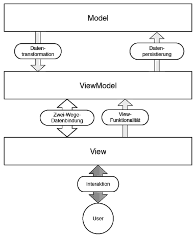

>Polymer beschreibst du ja schon in den vorherigen Kapiteln, für Angular würde denke ich eine grobe Architektur-/Konzepte-Übersicht (https://docs.angularjs.org/guide/concepts) reichen, dann ein Abschnitt, welche Probleme von beiden Frameworks gelöst werden mit Gemeinsamkeiten/Unterschieden und ein Abschnitt mit Themen, die nur jeweils eins der beiden Frameworks angeht.

- TODO: 
  + wie in Abbildung X dargestellt

## Vergleich mit AngularJS Implementierung

- TODO

- Die mit Polymer implementierte Multi-Navigations-Applikation wird möglichst ähnlich mit Angular nachgebaut
- Diese beiden unterschiedlichen Implementierungen, sowie generelle Unterschiede beider Frameworks bzw. Bibliotheken werden in diesem Abschnitt miteinander verglichen

(Notwendig?)

### AngularJS Einstieg

*Einleitung*

- Häufig mit Polymer in Zusammenhang gebracht wird AngularJS
- AngularJS ist ein, ebenfalls von Google entwickeltes, clientseitiges open-source JavaScript-Framework zur Erstellung von dynamischen SPAs
- Ebenso wie Polymer erlaubt es Angular eigene HTML Elemente, unter AngularJS `Directives` genannt, zu erstellen, welche die native Sammlung an HTML Elementen erweitern können

*Architektur* (mit Einleitung zusammenfassen?)

- Ist ein `Fat-Client` Framework, welches die gesamte Logik, sowie die Präsentations-Schicht auf dem Client hält und an ein serverseitiges Model, welches die Daten hält, angebunden werden kann
- AngularJS verfolgt den MVVM-Modell Ansatz, wie in Abbildung X dargestellt [citeulike:13920434]
- Eine Erweiterung des MVC Models, wobei die Controller-Schicht durch eine ViewModel-Schicht ersetzt wird
- Die ViewModel-Schicht kann als eine Art Proxy aufgefasst werden, welche der View-Schicht nur die Daten des Models liefert, die sie tatsächlich benötigt und transformiert sie, damit sie von der View-Schicht ausgegeben werden können
- Ebenso stellt sie die von der View-Schicht benötigten Funktionalitäten zum ändern der Daten bereit

*Konzepte*

- Grundkonzepte von AngularJS
- Two-Way Data-Binding: Datenbindung in zwei Richtungen, Änderungen am Model werden automatisch im DOM abgebildet, Benutzerinteraktionen innerhalb des Views werden auf das Model angewendet. Dadurch fällt die Manipulation des DOMs mithilfe von JavaScript bzw. jQuery weg. Diese wird von Angular intern mittels der jQuery-lite, einer vereinfachten, leichteren Version von jQuery bewerkstelligt
- Controllers: TODO
- Direktiven: HTML um eigene Elemente und Attribute erweitern, dessen Logik in den Direktiven gekapselt wird

### Problemlösungen von Polymer und AngularJS

### Themen, die nur jeweils eins der beiden Frameworks angeht

**-----------------------------------------**

# Polymer und Angular im Vergleich - Thoughts

- Polymer ist eine Bibliothek um Web Komponenten zu erstellen, welche eine Sammlung an sich noch in der entwicklung befindenden Technologien und APIs sind um eigene HTML Elemente zu definieren
- Mit Hilfe von Polyfills und zusätzlichen Features kann es diese eigenen Elemente erstellen und sie auch auf browsern zum einsatz bringen, welche die standards noch nicht unterstützen
- Angular hingegen stellt APIs auf Framework-Ebene bereit wie Services, Routing, Serverkommunikation etc.
- Polymer hat das nicht, sondern es gibt Iron Elemente, also mit Polymer entwickelte Komponenten, welche ähnliche Funktionalitäten bieten
- Es kümmert sich mehr darum, das Entwickeln solcher umfangreichen, mächtigen und wiederverwendbarer Komponenten zu ermöglichen
- Mit diesen wiederum können Applikationen gebaut werden, wie sie mit Angular gebaut werden
- Polymer eher mit einer Direktiven von Angular vergleichbar, statt mit dem gesamten Framework an sich, welches für das entwickeln von komplexen Applikationen entworfen ist

# Gemeinsamkeiten zwischen Polymer und einer Angular Direktive

- Two-Way Data Binding
- Deklarative Templates
- shadow DOM eermöglicht kapselung von Markup und CSS

# Unterschiede zwischen Polymer und Angular

- Angular ist ein robusteres Framework, da es auch auf einer breiterem Spektrum an Browsern benutzt werden kann (z.b IE8)

- X http://www.binpress.com/blog/2014/06/26/polymer-vs-angular/ 

- http://www.oyecode.com/2015/05/angularjs-20-or-polymer-open-discussion.html
- http://slides.com/jshcrowthe/polymer-webcomponents-and-angularjs#/24
- https://github.com/Polymer/project/issues/1
